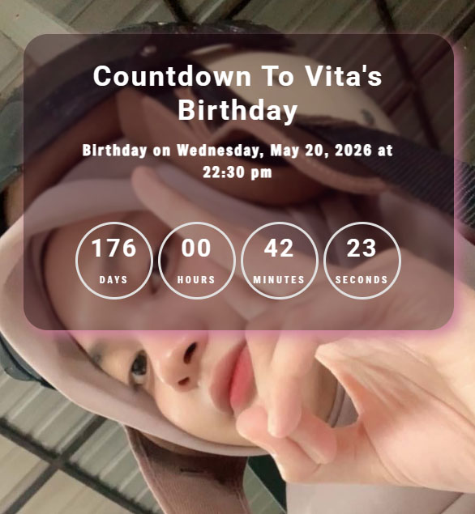

# Vita Birthday Countdown



## Description

A simple countdown timer application for Vita's birthday. This project displays an interactive countdown to the special day.

**🌐 Live Website:** Visit the countdown timer at [https://halip26.github.io/vita-birthday-countdown](https://halip26.github.io/vita-birthday-countdown)

## Features

- ⏱️ Real-time countdown timer
- 🎉 Birthday celebration theme
- 📱 Responsive design
- ✨ Clean and intuitive UI

## Installation

1. Clone the repository:

```bash
git clone https://github.com/Halip26/vita-birthday-countdown.git
```

2. Navigate to the project directory:

```bash
cd vita-birthday-countdown
```

3. Open `index.html` in your browser or install dependencies if applicable.

## Usage

Simply open the application in your web browser to see the countdown timer in action.

## Technologies Used

- HTML5
- CSS3
- JavaScript

## Project Structure

```
vita-birthday-countdown/
├── index.html
├── style.css
├── script.js
├── preview.png
└── README.md
```

## Contributing

Contributions are welcome! Feel free to submit a pull request.

## License

This project is licensed under the MIT License.

## Author

Halip26 - [@Halip26](https://github.com/Halip26)

---

**Happy Birthday Vita! 🎂🎈**
